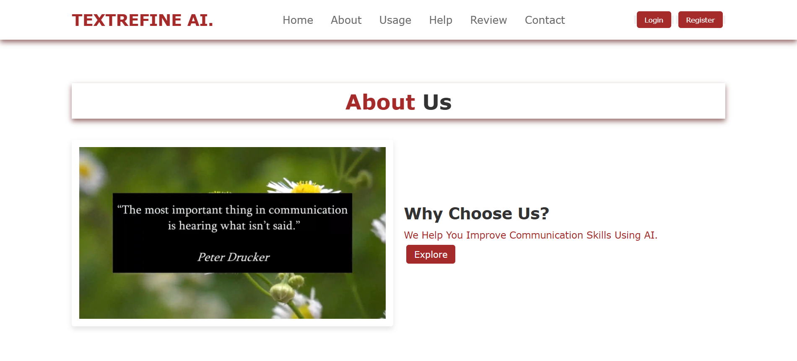
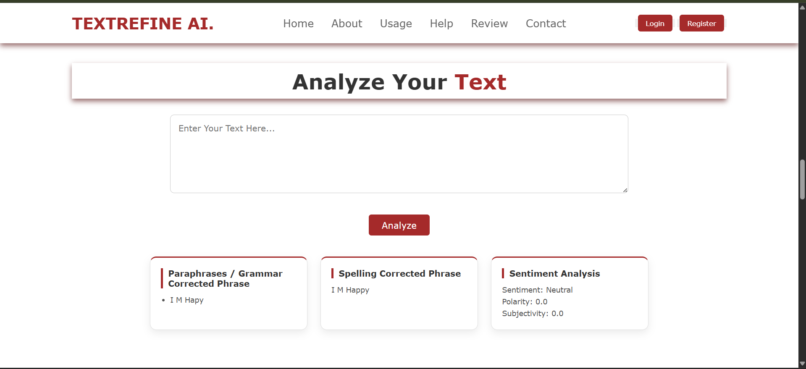
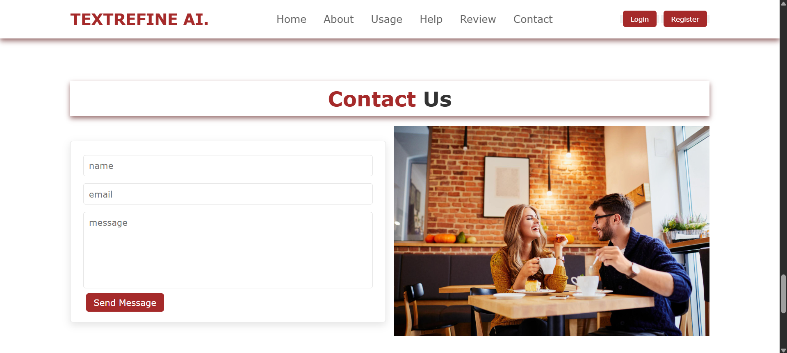
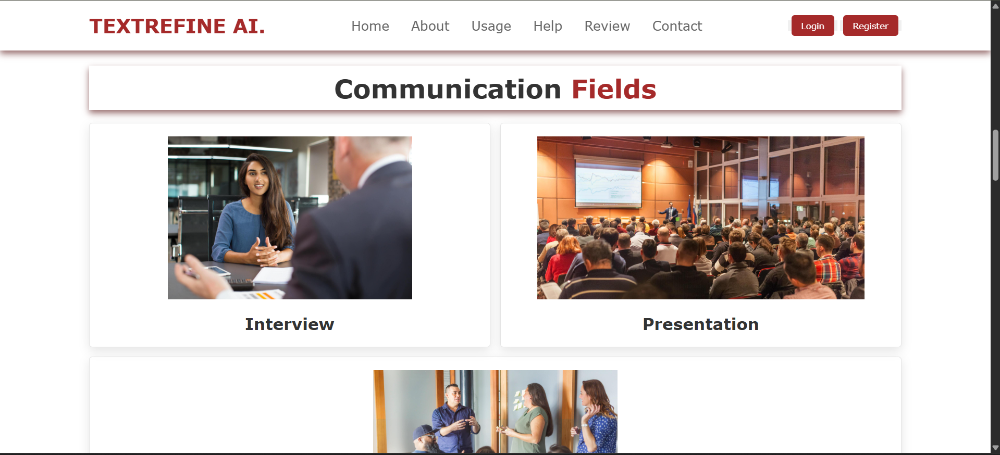
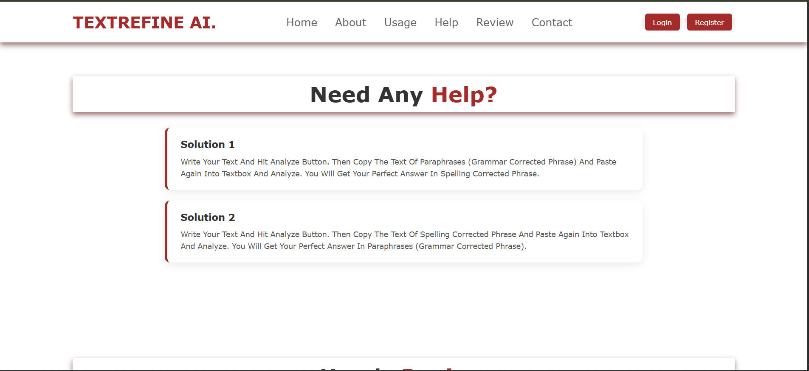
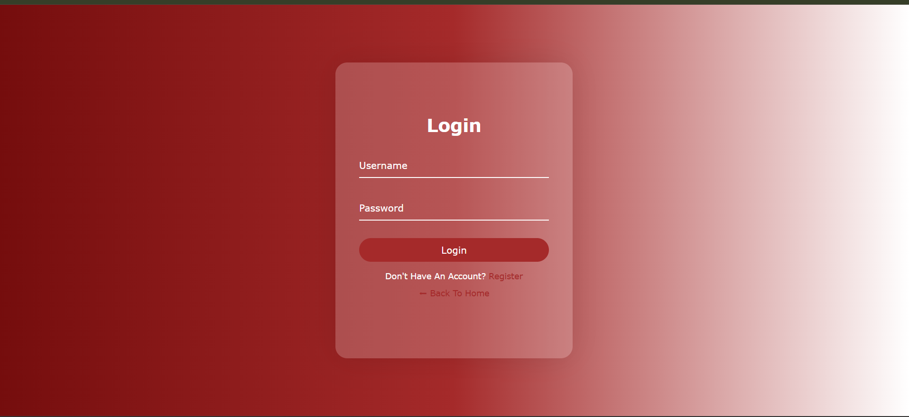
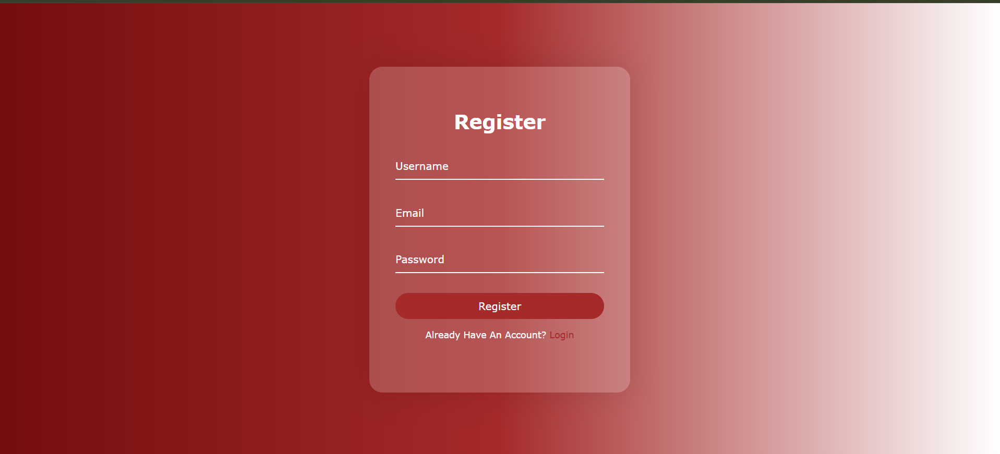
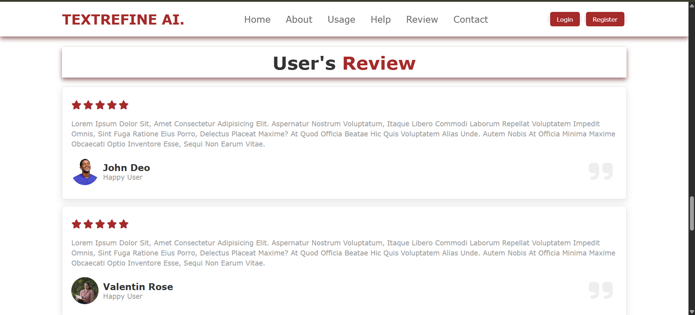

<div align="center">

#  TEXTREFINE AI

### Grammar Correction • Paraphrasing • Sentiment Analysis

<p>
An AI-powered text refinement platform that enhances writing by correcting grammar, improving phrasing, and analyzing sentiment in real-time.
</p>

<br/>

<a href="YOUR_LIVE_LINK_HERE" target="_blank">
  
</a>

<br/><br/>


</div>

---

## Overview

**TEXTREFINE AI** is a web-based application designed to improve written communication using artificial intelligence.

It provides:
- Grammar correction  
- Paraphrasing suggestions  
- Spelling correction  
- Sentiment analysis  

The system is built to help users refine text for professional, academic, and everyday communication.

---

## Screenshots & Explanation

<div align="center">

| About Section |
|--------------|
|  |

</div>

### About Page

- Introduces the purpose of the platform  
- Focuses on improving communication using AI  
- Includes motivational context and platform vision  

---

<div align="center">

| Text Analysis |
|--------------|
|  |

</div>

### Text Analysis Module

- Core feature of the application  
- User inputs text into the textbox  
- After clicking **Analyze**, system returns:
  - **Paraphrased / Grammar Corrected text**
  - **Spelling corrected version**
  - **Sentiment analysis (polarity & subjectivity)**  

---

<div align="center">

| Contact Page |
|-------------|
|  |

</div>

### Contact Section

- Allows users to send queries or feedback  
- Includes form fields:
  - Name  
  - Email  
  - Message  

---

<div align="center">

| Communication Fields |
|---------------------|
|  |

</div>

### Communication Fields

- Demonstrates real-world use cases:
  - Interview communication  
  - Presentations  
- Shows how the tool helps refine communication in different scenarios  

---

<div align="center">

| Help Section |
|--------------|
|  |

</div>

### Help / Usage Guide

- Provides step-by-step usage instructions  
- Suggests workflow:
  1. Analyze text  
  2. Use corrected output  
  3. Re-analyze for refinement  

---

<div align="center">

| Login | Register |
|------|----------|
|  |  |

</div>

### Authentication Pages

- Secure login and registration system  
- Allows user account creation  
- Supports personalized usage  

---

<div align="center">

| User Reviews |
|-------------|
|  |

</div>

### User Review Section

- Displays feedback from users  
- Includes ratings and testimonials  
- Helps build trust and credibility  

---

## Key Features

- Grammar correction and paraphrasing  
- Spelling correction system  
- Sentiment analysis (polarity & subjectivity)  
- Clean and user-friendly interface  
- Authentication system (login/register)  
- Contact and feedback system  
- Multi-page structured application  

---

## Technology Stack

<div align="center">

| Category | Technology |
|----------|-----------|
| Backend |  Python |
| NLP |  Text Processing |
| Framework |  Flask |
| Frontend |  HTML  CSS  JavaScript |

</div>

---

## Project Structure

```
04_textrefine_ai/
├── app.py
├── templates/
│   ├── index.html
│   ├── about.html
│   ├── contact.html
│   ├── help.html
│   ├── login.html
│   ├── register.html
│   └── review.html
├── static/
│   ├── style.css
│   └── scripts.js
├── assets/
│   ├── about.png
│   ├── analysis.png
│   ├── contact.png
│   ├── fields.png
│   ├── help.png
│   ├── login.png
│   ├── register.png
│   └── review.png
├── requirements.txt
└── README.md
```

---

## How It Works

1. User inputs text  
2. Backend processes text using NLP techniques  
3. System generates:
   - Corrected grammar  
   - Paraphrased text  
   - Spelling corrections  
   - Sentiment scores  
4. Results displayed instantly on UI  

---

## Use Cases

- Improving writing skills  
- Resume and professional writing  
- Academic content refinement  
- Email and communication enhancement  

---

## Future Improvements

- Advanced AI models (LLMs)  
- Multi-language support  
- Tone detection and rewriting  
- Export/download results  
- Real-time suggestions  

---

## License

This project is licensed under the MIT License.

---

<div align="center">

Developed by  
<strong>priyanildz</strong>

</div>